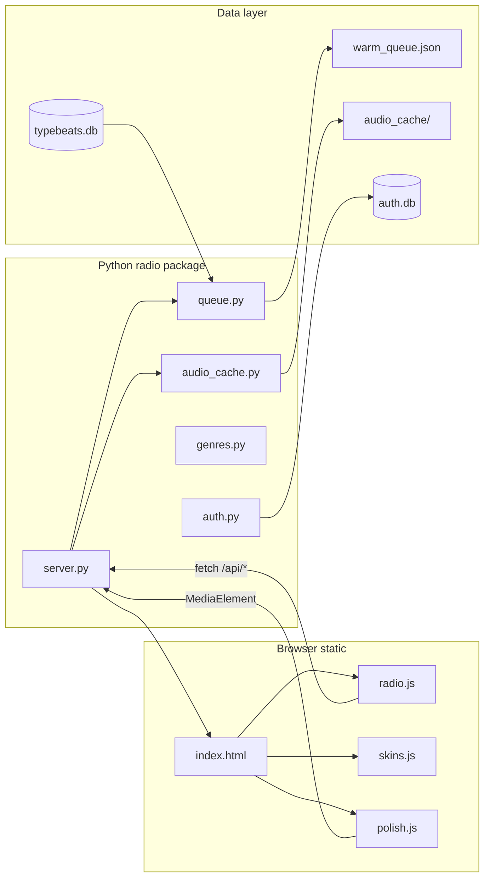

# TypeBeat Radio — LLM context (master handoff)

**Cache-bust (static assets):** `?v=ui-polish-95` on all CSS/JS in `radio/static/index.html`. Bump together with `HANDOFF.md`, `DESIGN_SYSTEM.md`, `THEMES.md`, and this file after any static change.

**Last updated:** 2026-09-24 · **Active product:** `radio/` (not Streamlit, not `web/` scaffold).

---

## 1. Purpose and repo scope

TypeBeat is an underground **type-beat discovery / listening** project. The **shipping listener experience** is **TypeBeat Radio**: a local HTTP server + custom HTML/CSS/JS player that reads a SQLite catalog (`typebeats.db`) and streams YouTube audio (local extract when possible).

| Area | Path | Role |
|------|------|------|
| **Radio (product)** | `radio/` | Lean-back player, filters, skins, Web Audio polish, invite auth |
| **Streamlit catalog** | `app.py` | Separate admin/catalog UI — **do not conflate with radio layout** |
| **Next scaffold** | `web/` | Early Next.js shell — **not** the radio UI |
| **Harvest / ETL** | Root `*.py` scripts | Scrape, tag, harvest producers, build DB |
| **Catalog DB** | `typebeats.db` | Primary beats table (+ indexes built at radio cold start) |
| **Vision docs** | `PRD.md`, `PRD_v2.md`, … | Product direction — not runbooks |

When the user says “radio” or “player,” work under **`radio/`** unless they explicitly ask for Streamlit or `web/`.

---

## 2. Architecture



**Request path:** Browser loads `/` → `index.html` → `skins.js` (sets `html[data-skin]` before paint) → `radio.js` (transport, queue, xfade) → `polish.js` (Web Audio graph). Queue and filters call **`GET /api/queue`** with query params; playback tries **`GET /api/audio/<video_id>`** (yt-dlp same-origin audio) and falls back to YouTube iframe if extract fails.

---

## 3. Run locally

```bash
cd /Users/maximrahr/Documents/typebeat
python3 -m venv venv   # once
source venv/bin/activate
pip install yt-dlp     # once; ffmpeg recommended (brew install ffmpeg)
cp .env.example .env   # optional — Google OAuth + session secret (see AUTH.md)

python -m radio
# → http://127.0.0.1:8765/?v=ui-polish-95
```

**Verify audio tooling:** `GET /api/audio/tools` → `{ "ready": true }` (yt-dlp on PATH). Without it, crossfade overlap and compressor run in **iframe fallback** (volume fade only, no true A↔B graph overlap).

**Verify crossfade:** DevTools console should log **`[xfade] overlap active`** on Next when local audio is hot.

---

## 4. File map (radio + critical root)

### Server (`radio/`)

| File | Purpose |
|------|---------|
| `__main__.py` | Entry: `python -m radio` |
| `server.py` | Threading HTTP server, routes, warm queue, static files |
| `queue.py` | SQL queue builder, warm playlist, prolific JOIN, age filter |
| `genres.py` | Genre stations + view tier definitions |
| `audio_cache.py` | yt-dlp extract → `radio/data/audio_cache/` |
| `auth.py` / `auth_db.py` | Sessions, Google OAuth, invites |
| `invite_admin.py` | CLI invite management |
| `data/warm_queue.json` | Cached default “All” rotation |
| `data/events.jsonl` | Client POST `/api/events` log |

### Static (`radio/static/`)

| File | Purpose |
|------|---------|
| `index.html` | Shell, atmosphere SVG filters, stage layout, script tags + `?v=` |
| `tokens.css` | Design tokens (`--art-size`, rails, CDJ pad height) |
| `radio.css` | Layout, left filter rail, compressor, invite, transport |
| `skins.css` | Deck vinyl + Tape chrome, CDJ chips, title transitions |
| `skins.js` | Skins, Exp panel, filters mount, vinyl/tape title chrome |
| `radio.js` | Queue, nav lock, crossfade orchestration, auth, reactions |
| `polish.js` | Dual `<audio>` graph, EQ, DynamicsCompressor, `crossfadeTo` |
| `as-tape/` | Cassette PNG assets (frame, reels, sprockets) |
| `fonts/README.md` | Font licensing notes |

### Harvest / DB (repo root — pointer only)

| Script | Typical role |
|--------|----------------|
| `scraper.py`, `discovery.py`, `discovery_v2.py` | Ingest YouTube metadata |
| `tagger.py`, `tag_ffp.py` | Genre / free-for-profit tagging |
| `producer_harvester*.py`, `build_producer_priority.py` | Producer lists |
| `db_setup.py` | Minimal `beats` schema bootstrap |
| `analyze_producer_activity.py` | Activity analytics |

**Schema (simplified):** `beats(video_id, title, artist_style, channel_name, url, views, upload_time_raw, scraped_at)` — radio queue adds genre/tier filters via tagged columns and side DBs (see `queue.py`).

---

## 5. HTTP API summary

| Method | Path | Notes |
|--------|------|--------|
| GET | `/`, `/index.html` | Player shell |
| GET | `/static/*` | CSS, JS, assets |
| GET | `/api/health` | DB, indexes, warm queue, yt-dlp status |
| GET | `/api/genres` | Stations + view tiers |
| GET | `/api/queue` | Paginated tracks — see §6 |
| GET | `/api/audio/tools` | yt-dlp/ffmpeg readiness |
| GET | `/api/audio/<id>/info` | Cache status |
| GET | `/api/audio/<id>` | Stream audio (may 503 → client iframe fallback) |
| GET | `/api/audio/<id>?prepare=1` | JSON after extract attempt |
| GET | `/api/audio/<id>?kick=1` | Background extract |
| GET | `/api/auth/status`, `/api/me` | Session |
| GET | `/auth/google`, `/auth/google/callback`, `/auth/logout` | OAuth |
| GET | `/admin/invites?token=…` | Invite admin UI |
| POST | `/api/invite-request` | Unauthed invite form |
| POST | `/api/reactions` | Like/dislike (authed) |
| POST | `/api/events` | Client telemetry batch |

---

## 6. Queue and filters

**Client → server:** `radio.js` builds `/api/queue` with:

- `genre` — station id from `/api/genres` (default `all`)
- `tier` / `view_tier` — views band (`all`, `lt1k`, `1k5k`, …)
- `min_views` / `max_views` — optional overrides
- `is_free` / `free_for_profit` — clearance chips
- `prolific=1` — restrict to channels in `prolific_producers.txt` side DB
- `max_age_months` — track age ceiling (left rail slider)
- `limit`, `cursor` — pagination
- `live=1` — bypass warm memory shortcut

**Warm shortcut:** Default “All + full tier + no extra filters” serves shuffled `warm_queue.json` instantly; prolific/age/free/ffp force live SQL.

**Station deferral (UX):** Changing genre while a track is loaded **arms** pending station; chip reads **NEXT UP** then **CHANGE NOW?**; user confirms with **Next** or re-clicks the chip; **Prev** cancels — see `DESIGN_SYSTEM.md`.

**Not fit:** Per-genre hide list in `typebeat.radio.notFit` (localStorage), not server-side.

---

## 7. Audio path

1. **Preferred:** `radio.js` prepares `/api/audio/<video_id>` → `<audio>` elements → `polish.js` graph (EQ → **DynamicsCompressor** → makeup → limiter).
2. **Crossfade:** Dual slot A↔B; `polish.crossfadeTo()` equal-power gain ramps (~7s default). **Never** re-call `connectDualMedia` mid-overlap (historical silence bug).
3. **Fallback:** YouTube iframe — cross-origin; **volume fade only** (~480ms), not true overlap.
4. **Compressor UI:** Drag on meter sets `polishAmount` (`typebeat.radio.polishAmount`); orange fill = **set amount**, not live GR. Spectrum = `#audio-viz` canvas above meter.

Exp controls (persisted): `typebeat.radio.xfadeMode`, `xfadePreload`, `xfadeHandoffGate`, `xfadeOverlapMin`, `xfadeStartAt`, optional `xfadeDebug`.

---

## 8. UI: skins, Exp, filters

### Skins (`html[data-skin]`)

- **`deck`** — Vinyl platter, liquid glass atmosphere, **SVG title on sticker** (placement presets via Exp; default top inner rim).
- **`tape`** — Layered cassette (`as-tape-chrome`), reels spin when `.art.is-playing`, **clear window** (no frost overlay), label title with Exp transition modes.

Legacy skin ids migrate in `skins.js` (`LEGACY_TO_SKIN`).

### Locked (no Exp picker — forced on load)

- Shape: `cdj-ink`
- Glass: `glass`
- Views UI: slider only
- Compressor UI: meter only
- Tape font: Permanent Marker
- Vinyl name + spin: always on (`is-vinyl-name`, `is-vinyl-spin`)

### Exp panel (right rail, Shift+E)

- Skin (deck/tape)
- Crossfade duration / preload / overlap / start-at
- Title transition: **fade** (vinyl + tape default), **wipe**, **blur**, **tick** (tape label)
- **Vinyl title (deck):** placement chips + scale slider (50–400%)

**Removed from Exp (≤ ui-polish-94):** Orb position tuners — reaction offsets are **`DEFAULT_REACT_POS`** in `skins.js` (`applyReactPosVars`); `tb_radio_react_pos` cleared on load.

**Removed in ui-polish-64:** Tape window frost (`tb_radio_tape_glass`, `data-tape-glass`, `.as-tape-chrome__window-glass`).

### Left rail

Views slider → Track age slider → Genre chips → Clearance (**FREE** / **FFP** — face label **FFP**, full phrase in tooltip + `aria-label`) → Prolific checkbox. **Do not** set `overflow: hidden` on `.filter-rail`.

---

## 9. Persistence keys

| Key | Owner | Purpose |
|-----|-------|---------|
| `tb_radio_skin` | skins.js | `deck` \| `tape` |
| `tb_radio_prolific` | skins.js | Prolific filter |
| `tb_radio_max_age_months` | skins.js | Track age |
| `tb_radio_chip_shape` | skins.js | Forced `cdj-ink` |
| `tb_radio_glass` | skins.js | Forced `glass` |
| `tb_radio_compress_ui` | skins.js | Forced `meter` |
| `tb_radio_tape_font` | skins.js | Forced permanent-marker |
| `tb_radio_exp_fold` | skins.js | Exp panel folded |
| `tb_radio_title_xfade` | skins.js | fade \| wipe \| blur \| tick |
| `tb_radio_vinyl_title_placement` | skins.js | inner_rim_top \| inner_band_wrap \| lower_inner_arc |
| `tb_radio_vinyl_title_scale` | skins.js | 50–400 (default 100) |
| `typebeat.radio.viewTier` | radio.js | Views tier id |
| `typebeat.radio.xfadeMode` | radio.js | graph7 default, etc. |
| `typebeat.radio.xfadePreload` | radio.js | aggressive default |
| `typebeat.radio.xfadeHandoffGate` | radio.js | allow_buffer_wait |
| `typebeat.radio.xfadeOverlapMin` | radio.js | auto |
| `typebeat.radio.xfadeStartAt` | radio.js | start offset ms |
| `typebeat.radio.xfadeDebug` | radio.js | `1` = verbose |
| `typebeat.radio.polishAmount` | radio.js | Compressor amount |
| `typebeat.radio.polishPreset` | radio.js | Legacy preset label |
| `typebeat.radio.loopTrack` | radio.js | Loop one track |
| `typebeat.radio.deviceId` | radio.js | Analytics id |
| `typebeat.radio.notFit` | radio.js | Per-genre hide map |
| `typebeat.radio.events` | radio.js | Buffered client events |

Removed on load: `tb_radio_tape_glass`, `tb_radio_react_pos`, legacy vinyl/sponge/shape toggles (see `skins.js` init).

---

## 10. Recent UI history (polish-61 → 95)

| Batch | Highlights |
|-------|------------|
| **ui-polish-61** | Genre `--chip-fit`; vinyl **full ring** title; views two-line labels; Marker-sponge (tape) |
| **ui-polish-62** | Sticker `object-fit: cover`; vinyl title **upper arc only**; chip-fit tuning |
| **ui-polish-63** | Track age two-line labels; **tape frosted window** + Exp frost; removed sponge → Wipe/Blur/Tick |
| **ui-polish-64** | **Rollback tape frost**; **restore vinyl full 360° ring**; LLM docs; cache bump |
| **ui-polish-65 → 94** | Vinyl **title placement + scale** Exp; **orb tuners removed** + locked `DEFAULT_REACT_POS`; pending genre **NEXT UP** / **CHANGE NOW?**; clearance **FFP** face label |
| **ui-polish-95** | Seven-pillar pass: **`react-like-lift`** (no like-bounce); functional type ≥ ~11px; deck+tape play **focus-visible**; skip/play/compress **aria** + tips; compressor fill **scaleY**; cache **95** |

Tape label transitions from 63 (**Fade / Wipe / Blur / Tick**) are unchanged. Vinyl default placement is **top inner rim** (`inner_rim_top`); **Upper wrap** restores a full inner ring path.

---

## 11. Do-not-regress checklist

- [ ] Local Next: `[xfade] overlap active` in console; no blip→silence→restart
- [ ] Prev/Next never use HTML `disabled`; nav lock + watchdogs intact
- [ ] `.filter-rail` not `overflow: hidden`
- [ ] Compressor fill ≠ live GR; spectrum only in `#audio-viz`
- [ ] CDJ pad height `--cdj-pad-h: 3.2rem`; genre one line + `--chip-fit`
- [ ] Views + age sliders full rail width (not CDJ grid)
- [ ] Tape: reels visible in window; pause freezes reel animation
- [ ] Vinyl: title on ring, updates on track change without waiting for audio handoff
- [ ] Do not re-add tape frost Exp or `window-glass` overlay

Full norms: **`DESIGN_SYSTEM.md`**. Session checklist: **`HANDOFF.md`**.

---

## 12. Where to change X

| Goal | Where |
|------|--------|
| Genre chips / stations | `genres.py`, chip DOM in `skins.js`, styles in `radio.css` / `skins.css` |
| Views tier labels | `skins.js` (`viewsTierLinesHtml`), `radio.css` |
| Track age slider | `skins.js` mount, `radio.css` |
| Vinyl title path / fit | `skins.js` (`buildVinylTitle`, `fitVinylTitleFont`), `skins.css` `.vinyl-title*` |
| Tape reels / cover / label | `skins.js` (`ensureAsTapeChrome`, `syncAsTapeCover`), `skins.css` `.as-tape-chrome*` |
| Tape title transitions | `html[data-title-xfade]`, `skins.css` label layers, Exp in `skins.js` |
| Crossfade behavior | `radio.js`, `polish.js` — touch only with overlap tests |
| Compressor amount / graph | `polish.js`, meter UI in `radio.css` / `radio.js` |
| Cache bust | `index.html` `?v=` + doc cache lines |
| Queue SQL / warm | `queue.py`, `server.py` warm path |
| Auth / invites | `auth.py`, `AUTH.md`, invite UI in `index.html` / `radio.js` |

---

## 13. Open questions / soft spots

- **Reaction orb offsets** are fixed in `DEFAULT_REACT_POS` — edit `skins.js`, not Exp.
- **FFP** pad is three letters; long copy is tooltip / aria only.
- **Tape PNGs** degrade cosmetically at very high zoom; tokens still scale.
- **No git history** on repo yet — diffs are working-tree only; document behavior in HANDOFF when landing risky changes.
- **YouTube ToS / production:** local yt-dlp extract is documented as personal/dev use in `server.py` header.

---

## 14. Related docs (read order for humans / LLMs)

1. **`LLM_CONTEXT.md`** (this file) — attach first for a cold LLM  
2. **`HANDOFF.md`** — current batch + verify table  
3. **`DESIGN_SYSTEM.md`** — normative rules  
4. **`THEMES.md`** — skin keys + Exp list  
5. **`AUTH.md`** — OAuth + invites  
6. **`PRD_v2.md`** — product vision (repo root)
